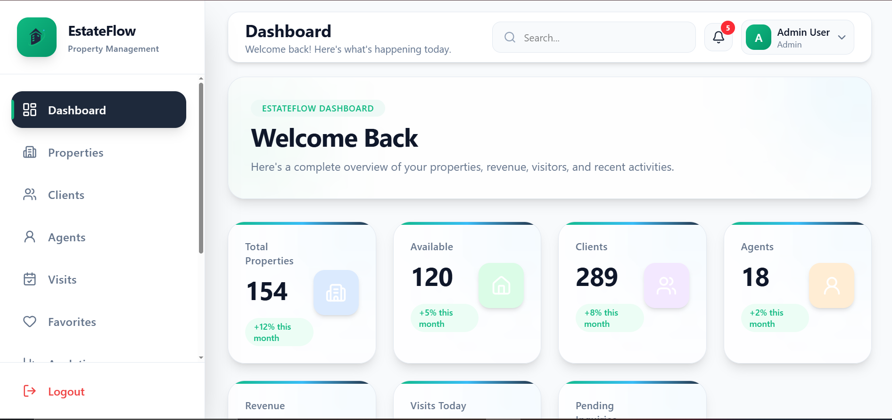
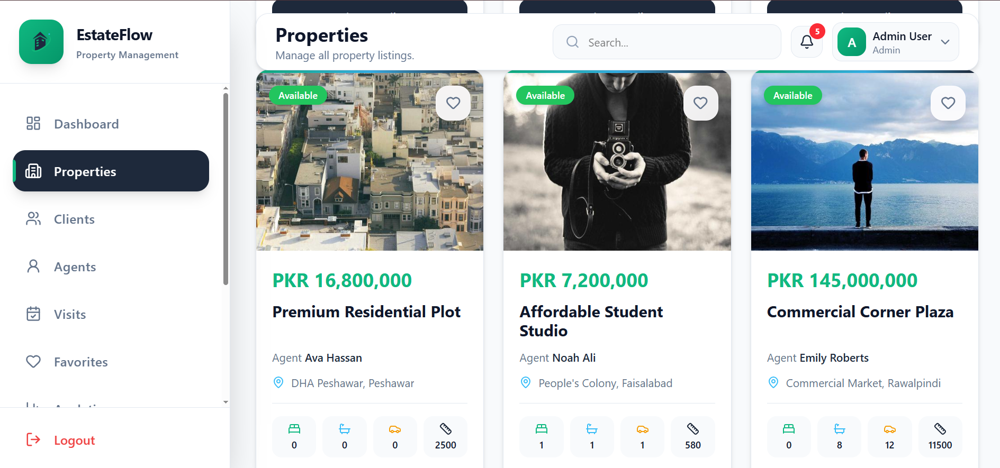
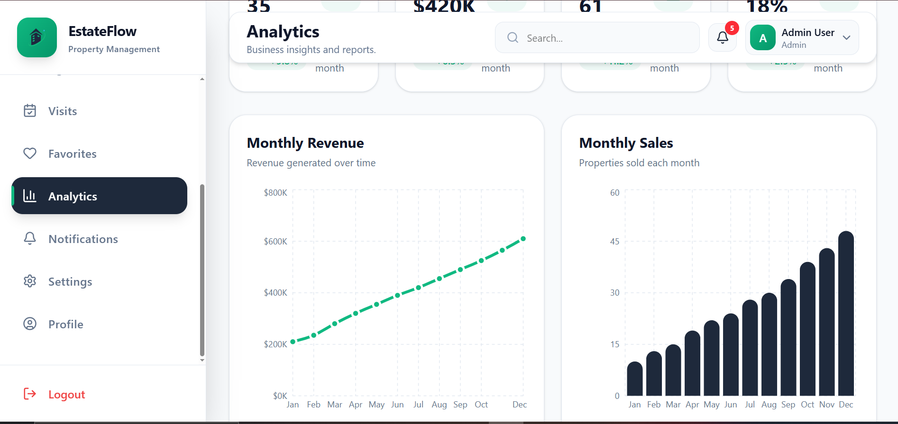
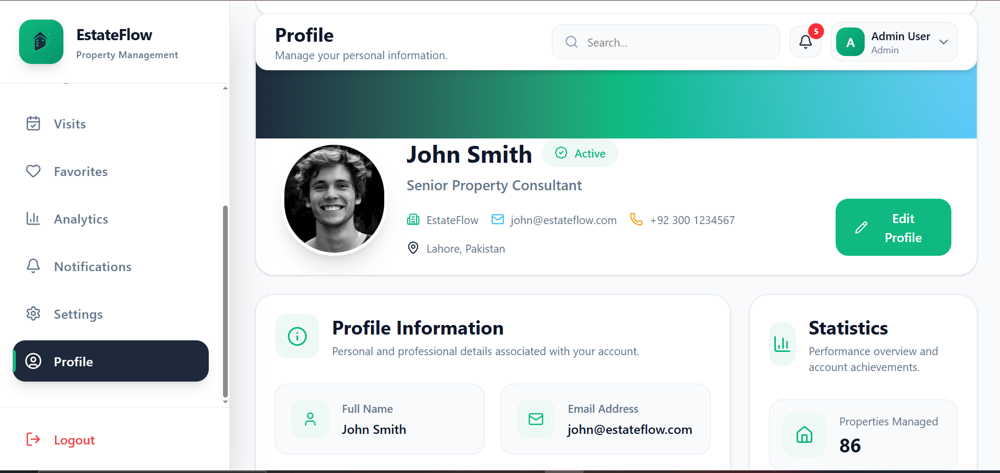

# 🏡 EstateFlow

A modern **Property Management Dashboard** built with **React**, **Vite**, and **Tailwind CSS**. EstateFlow provides a complete frontend solution for managing properties, clients, agents, visits, analytics, favorites, notifications, user profiles, and application settings.

> 🚀 Live Demo: **https://estate-flow-esxf.vercel.app/**

---

## 📸 Screenshots

| Dashboard | Properties |
|-----------|------------|
|  |  |

| Analytics | Profile |
|-----------|---------|
|  |  |

---

# 🚀 Tech Stack

<p align="left">


</p>

---

# ✨ Features

## 🏠 Dashboard

- Property overview
- Revenue statistics
- KPI cards
- Charts
- Recent activities

---

## 🏘 Property Management

- View all properties
- Search
- Filters
- Sorting
- Pagination
- Property Details
- Image Gallery
- Agent Information
- Reviews
- Book Visit

---

## 👥 Client Management

- Client CRM
- Search
- Filters
- CRUD Interface
- Status Badges
- Pagination

---

## 🧑‍💼 Agent Management

- Agent Cards
- Agent Details
- Statistics
- Reviews
- Assigned Properties
- Recent Sales

---

## 📅 Visit Scheduling

- Upcoming Visits
- Completed Visits
- Status Tracking
- Visit Modal
- Calendar UI

---

## ❤️ Favorites

- Add / Remove Favorites
- Redux Toolkit State Management
- Optimistic Updates

---

## 🔔 Notifications

- Notification Dropdown
- Mark All Read
- Clear Notifications
- Notification Page
- Read / Unread Filters

---

## 📊 Analytics

- KPI Cards
- Revenue Chart
- Sales Chart
- Property Distribution
- City Distribution
- Top Agents
- Analytics Filters

---

## ⚙ Settings

- General Settings
- Appearance
- Theme Preferences
- Notification Preferences
- Language Settings
- Security Settings
- Local Storage Persistence

---

## 👤 User Profile

- Profile Header
- About Section
- Social Links
- Statistics
- Edit Profile Modal
- Avatar Preview
- Form Validation

---

# 📂 Folder Structure

```text
src/
│
├── components/
├── pages/
├── hooks/
├── context/
├── redux/
├── utils/
├── data/
├── layouts/
├── routes/
└── assets/
```

---

# 📦 Installation

Clone the repository

```bash
git clone https://github.com/malaikaahsan/Estate-Flow.git
```

Go to project

```bash
cd EstateFlow
```

Install dependencies

```bash
npm install
```

Start development server

```bash
npm run dev
```

---
## 🔑 Demo Accounts

Use the following credentials to explore the application.

| Role | Email | Password |
|------|-------|----------|
| 👑 Admin | `admin@estateflow.com` | `123456` |
| 🧑‍💼 Agent | `agent@estateflow.com` | `123456` |

### Permissions

#### 👑 Admin
- Full dashboard access
- Manage properties
- Manage clients
- Manage agents
- Schedule visits
- View analytics
- Manage notifications
- Update settings
- Manage profile

#### 🧑‍💼 Agent
- Dashboard access
- View assigned properties
- Manage clients
- Schedule visits
- View analytics
- Update profile
  
# 📱 Responsive Design

✅ Desktop

✅ Tablet

✅ Mobile

---

# 🎯 Learning Outcomes

This project demonstrates:

- React Components
- React Hooks
- Custom Hooks
- Context API
- Redux Toolkit
- React Router
- Tailwind CSS
- Responsive Design
- Component Reusability
- State Management
- Local Storage
- Form Validation
- Dashboard UI
- CRUD Patterns

---

# 🌐 Live Demo

👉 (https://estate-flow-esxf.vercel.app/)

---

# 👩‍💻 Author

**Malaika Ahsan**

GitHub:
https://github.com/malaikaahsan

LinkedIn:
https://www.linkedin.com/in/malaika-ahsan/

---

## ⭐ If you like this project, consider giving it a star!
